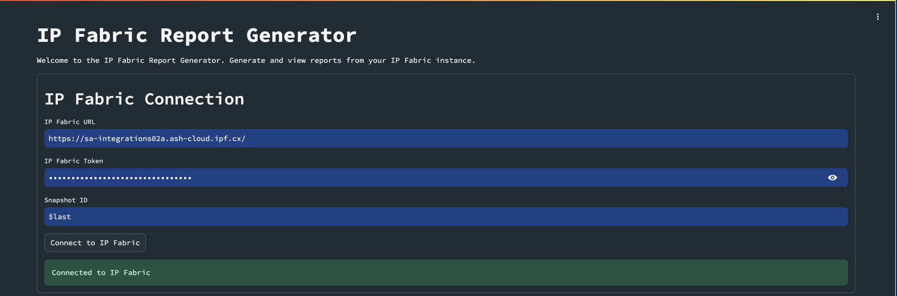
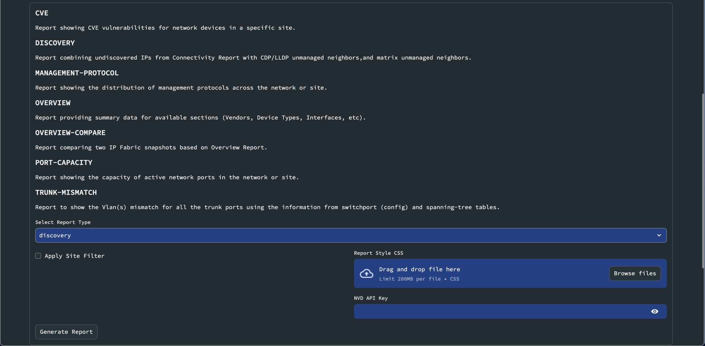
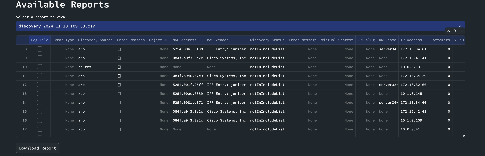

# IP Fabric Reports Generator

## Overview

The IP Fabric Reports Generator is a powerful Python package designed to streamline the process of creating comprehensive network reports using data from IP Fabric. This tool automates the generation of detailed reports on various aspects of your network infrastructure, providing valuable insights and visualizations.

**Integrations or scripts should not be installed directly on the IP Fabric VM unless directly communicated from the
IP Fabric Support or Solution Architect teams.  Any action on the Command-Line Interface (CLI) using the root, osadmin,
or autoboss account may cause irreversible, detrimental changes to the product and can render the system unusable.**

## Key Features

- **Automated Report Generation**: Quickly generate detailed reports with minimal manual input.
- **Multiple Report Types**: Supports various report types, easily extensible for additional reports.
- **Data Visualization**: Includes pie charts and tables for clear data representation.
- **Customizable Templates**: Use pre-defined templates or create your own to tailor reports to your needs.
- **PDF and HTML Output**: Generate reports in both PDF and HTML formats for easy sharing and viewing.
  - **CSV Output**: Available for specific reports only (Discovery, CVE).
  - **XLSX Output**: Available for specific reports only (Trunk Mismatch).
- **Environment Variable Configuration**: Easily configure the tool using environment variables or a .env file.
- **Customizable Styles**: Choose different CSS styles for your reports.

## Available Report Types

To see the full list of available reports, you can use the following command:

```bash
ipfabric-report --list
```

This will output:

```text
Available reports:
                  cve: Report showing the distribution of CVEs across the site (Site based only).
            discovery: Report combining undiscovered IPs from Connectivity Report with CDP/LLDP unmanaged neighbors, and matrix unmanaged neighbors.
  management-protocol: Report showing the distribution of management protocols across the network or site.
             overview: Report providing summary data for available sections (Vendors, Device Types, Interfaces, etc).
     overview-compare: Report comparing two IP Fabric snapshots based on Overview Report.
        port-capacity: Report showing the capacity of active network ports in the network or site.
       trunk-mismatch: Report providing more details for mismatched VLANs on trunk ports. (XLSX only)
```

## Getting Started

### Installation

```bash
pip install git+https://gitlab.com/ip-fabric/integrations/scripts/ipfabric-reports
```

### Configuration

Set up your environment variables in a `.env` file or in your system environment:

```text
IPF_URL=https://your-ipfabric-instance.com
IPF_TOKEN=your_token_here
IPF_SNAPSHOT_ID=your_snapshot_id_here
REPORT_TYPE=management-protocol  # or any other available report type
REPORT_STYLE=default_style.css  # Optional: specify a custom CSS file
LOGO_PATH=images/logo.png # Optional: specify a custom logo

# REPORT_SITE is Optional for majority of report types
# REPORT_SITE is Mandatory for the `cve` report type
REPORT_SITE=Site Name  

# INVENTORY_FILTER is only available for CVE Report - EXAMPLE={"vendor": ["eq", "arista"], "devType": ["eq", "switch" ]}
INVENTORY_FILTER=None                # IP Fabric Inventory filter (available for some report types only) 

# Special requirements for CVE Report
NVD_API_KEY=api_key # Request at `https://nvd.nist.gov/developers/request-an-api-key`
```

### Usage

#### Command Line Interface

1. List available report types:

   ```bash
   ipfabric-report --list
   ```

2. Generate a specific report:

   ```bash
   ipfabric-report --type management_protocol
   ```

   or

   ```bash
   ipfabric-report --type port_capacity
   ```

   If no type is specified, it will use the `REPORT_TYPE` from your environment variables.
   You will find your reports in the `export` directory.

3. Specify Site Name:

   ```bash
   ipfabric-report --type port_capacity --site "Site Name"
   ```

4. Specify a custom .env file:

   ```bash
   ipfabric-report --env /path/to/your/.env
   ```

5. Specify a custom CSS style:

   ```bash
   ipfabric-report --style custom_style.css
   ```

   If not specified, it will use the `REPORT_STYLE` from your environment variables, or default to `default_style.css`.

#### Python Script

You can also use the generator in your Python scripts:

```python
from ipfabric_reports import IPFabricReportGenerator

generator = IPFabricReportGenerator()
generator.generate_report()
```

Or with specific options:

```python
from ipfabric_reports import IPFabricReportGenerator

generator = IPFabricReportGenerator('/path/to/your/.env')
generator.report_type = 'port_capacity'
generator.report_style = 'custom_style.css'
generator.generate_report()
```

## Customizing CSS Styles

For detailed instructions on how to use and customize CSS themes for your reports, please refer to the [CSS Styles README](ipfabric_reports/styles/README.md).

## Extending the Tool

The IP Fabric Reports Generator is designed with extensibility in mind. You can easily add new report types by creating new report classes and updating the configuration. To add a new report type:

1. Create new config classes in `config.py`.
2. Create new collector class if needed in `data_collectors.py`.
3. Create a new report class in `report_types.py`.
4. Update the new report type in `report_registry.py`.
5. Add a new template for the report in the `templates` directory.
6. (Optional) Add a new CSS style in the `styles` directory.
7. Update the documentation to include the new report type.

## Streamlit Web Interface

To launch the Streamlit web interface, run the following command:

```bash
ipfabric-report --streamlit
```




This will start a local web server and open a browser window to the Streamlit interface.

## Installation as an IP Fabric Extension

To install the report generator as an IP Fabric extension, run the following command:

```bash
ipfabric-report --install-extension
```

This will install the report generator as an IP Fabric extension and make it available in the IP Fabric UI.

## Contributing

We welcome contributions! Please see our Contributing Guidelines for more information on how to get started.

## License

This project is licensed under the MIT License - see the LICENSE file for details.

## Support

For support, please open an issue on the GitHub repository or contact the maintainers directly.

---

The IP Fabric Reports Generator simplifies the process of creating detailed network reports, saving time and providing valuable insights into your network infrastructure. Whether you're conducting routine audits, troubleshooting issues, or maintaining documentation, this tool streamlines your workflow and enhances your network management capabilities.
